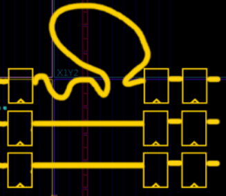

# Lab 3 

## Part 1 - RTL Design
Your task is to design, lay out, and verify an asynchronous fifo. 
This fifo should:
- have asynchronous reset
- have seperate read and write clocks and clock domains
  - use a 2-flip flop synchronizer to cross clock domains
  - use gray encoding when feeding multi-bit signals across a synchronizer
- write enable and write data inputs, write full output
- read enable and read data inputs, read empty output
- parameterized fifo width (width of read/write data)
- optional: parameterized fifo depth

The internet is full of asynchronous fifo implementations. The goal here is that you write your own so that you understand how they operate.
Here is a good starting point
- https://zipcpu.com/blog/2018/07/06/afifo.html


## Part 2 - Timing Constraints

### Openlane
Moving from one clock to two clocks, we need to add both clocks to the openlane configuration using the `CLOCK_PORT` variable. 

<table><tr><td> Json </td> <td> Yaml </td></tr><tr><td>

```Json
{
 "CLOCK_PORT": ["clk_r", "clk_w"]
}
```

</td><td>

```Yaml
---
CLOCK_PORT:
- clk_r
- clk_w

```

</td></tr></table>

When building our design in Openlane with one clock, we can set the period without defining design constraints. However, with more clocks we have to manually define the timing constraints using an SDC file. 
1. Create a file called `constraints.sdc`
2. Set that file as the SDC file for PNR and Signoff

<table><tr><td> Json </td> <td> Yaml </td></tr><tr><td>

```Json
{
 "PNR_SDC_FILE": "constraints.sdc",
 "SIGNOFF_SDC_FILE": "constraints.sdc"
}
```

</td><td>

```Yaml
---
PNR_SDC_FILE: constraints.sdc
SIGNOFF_SDC_FILE: constraints.sdc

```

</td></tr></table>

### Setting Multiple Clock Periods

Configure the design constraints to set the period of each clock. A sample is shown below. The shown periods are arbitrary. Make sure clocks are set to asynchronous so they are not assumed to align.

```
puts "\[INFO\]: Creating Clocks"
create_clock [get_ports clk_r] -name clk_r -period 7
set_propagated_clock clk_r
create_clock [get_ports clk_w] -name clk_w -period 14
set_propagated_clock clk_w

set_clock_groups -asynchronous -group [get_clocks {clk_r clk_w}]
```

### Setting Max Delay
We need to prevent the tools from messing up the validity of the gray-encoded clock domain crossing. One way it could mess up is to make the propagation delay of one of the bits way too high. To do this, we constrain its max delay. 
- To constrain max delay, we need to know about specific flip flops in our design
- Our design must already have synthesized to see the flip flops
- Use `openlane config.json --flow Classic -T yosys.synthesis` to run openlane only through the sythesis step
- View the netlist file (.nl.v) in the `final/nl` directory of your most recent run


```
puts "\[INFO\]: Setting Max Delay"

set read_period     [get_property -object_type clock [get_clocks {clk_r}] period]
set write_period    [get_property -object_type clock [get_clocks {clk_w}] period]
set min_period      [expr {min(${read_period}, ${write_period})}]

set_max_delay -from [get_pins r_gray.out*df*/CLK] -to [get_pins rcdc.r1*df*/D] $min_period
set_max_delay -from [get_pins w_gray.out*df*/CLK] -to [get_pins wcdc.r1*df*/D] $min_period
```

## Part 3 - CocoTB Verification
For this lab, we will learn to use cocotb as a powerful way to do verification. A template test has already been provided for you in the `cocotests` directory.

### Configuring

CocoTB needs to know what your top level module is, and where to look for verilog files. This configuration is done by editing the Makefile in the teste directory.
1. Set `COCOTB_TOPLEVEL` to the name of your top level module
2. Set `COCOTB_TEST_MODULES` to the name of your python test file
3. `VERILOG_SOURCES` should get auto configured, but if necessary set it to a list of paths to your verilog files.
4. `VERILOG_INCLUDE_DIRS` can be used to add more directories where include files (.vh or .svh) are located

### Running

To run your cocotb tests, use the following options:
- Run `make cocotests` in lab4 folder to run all cocotb tests.
- `cd` into a specific test and run `make` in that folder to run that specific tests

This will create a waveform file called `dump.fst` or `dump.vcd` in the test folder.

### Coroutines

Your testbench will likely want more than one concurrent function driving your DUT. This could be used to indepdently drive the read and write ports of your async fifo. 

```Python
async def function1 (dut):
    pass
async def function2 (dut):
    pass

@cocotb.test()
async def test(dut):
    task1 = cocotb.start_soon(function1(dut))
    task2 = cocotb.start_soon(function2(dut))
    await task1
    await task2
```